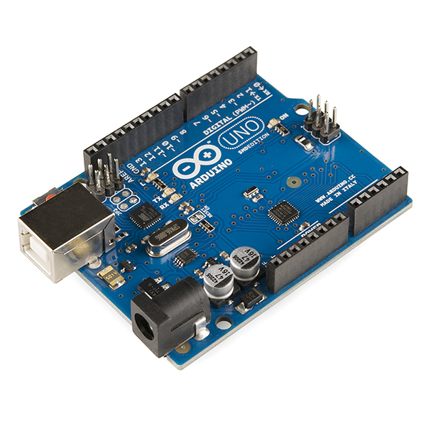

# VIN projekt - Odklepanje vrat z matrično tipkovnico

## Ideja
Ideja je preko tipkovnice prebrati varnostno kodo in na podlagi vnosa vrniti ustrezen odziv. V kolikor je bila prejeta koda pravilna se nam odprejo vrata (v mojem primeru sem vrata simuliral z zeleno LED, ki se obarva ob pravilni kombinaciji), v nasprotnem primeru smo opozorjeni, da vnesena koda ni pravilna.

## Delovanje
Arduino nano bere pritisnjene tipke na tipkovnici. Ob vsakem pritisku znak pošlje preko I2C komunikacije Arduino Unu. Ta doda znak k dosedaj prejetim znakom. V kolikor je prejeti znak * ali pa je koda daljša od 6 znakov preveri ali se prejeta koda ujema s pravo kodo. V kolikor se ujema se na zaslon izpiše dobrodošli in prižge se zelena LED, v nasprotnem primeru pa se na zaslon izpiše neveljavna koda in prižge se rdeča LED.

## Demonstracija (video)

## Shema vezja
Shema je priložena v obliki slike "VIN_shema.png"

## Komponente
- Arduino Uno
- Arduino Nano
- Matrična Tipkovnica (4x4)
- 2x LED (zelena in rdeča)
- LCD zaslon (16x2)

## Opis komponent

#### Arduino Uno

#### Arduino Nano

#### Matrična Tipkovnica (4x4)

#### LCD Zaslon (16x2)
